# Active Directory Group Policy Management

Documentation for creating, configuring, and deploying Group Policy Objects (GPOs) in Active Directory to enforce organization-wide security settings — session inactivity limits, logon warning banners, and Control Panel/PC settings restrictions — using the Group Policy Management Console (GPMC).

This repo documents the workflow used to build and roll out **`GPO_Corporate_Security_Hardening`**, a hardening policy applied across the domain to standardize security posture for users, groups, and roles throughout the organization.

## What this GPO enforces

| Setting | Location | Value |
|---|---|---|
| Machine inactivity limit | Computer Configuration → Windows Settings → Security Settings → Local Policies → Security Options | Locks the machine after **900 seconds (15 minutes)** of inactivity |
| Logon warning banner | Computer Configuration → Windows Settings → Security Settings → Local Policies → Security Options | Title: `WARNING: Security Notice` — displayed before any user can log on |
| Control Panel / PC settings restriction | User Configuration → Administrative Templates → Control Panel | **Enabled** — blocks Control Panel and PC settings access for targeted users |

## Repo contents

| Path | Purpose |
|---|---|
| `01-gpmc-console-overview.png` – `12-gpupdate-success.png` | Screenshots captured while building and deploying the GPO, referenced throughout this README |

## Requirements

- Group Policy Management Console (GPMC) — installed via RSAT on a management workstation, or available natively on a domain controller
- Domain Admin (or delegated GPO-creation) rights
- Target OUs already created in Active Directory (e.g. Accounting, Corporate, CyberSecurity, Human Resources, Information Technology)

---

## Walkthrough

### 1. Review the domain's OU structure

Before creating a GPO, confirm the OU structure it will eventually apply to. The domain here is organized by department: Accounting, Corporate, CyberSecurity, Domain Controllers, Human Resources, and Information Technology, alongside the built-in Group Policy Objects and WMI Filters containers.

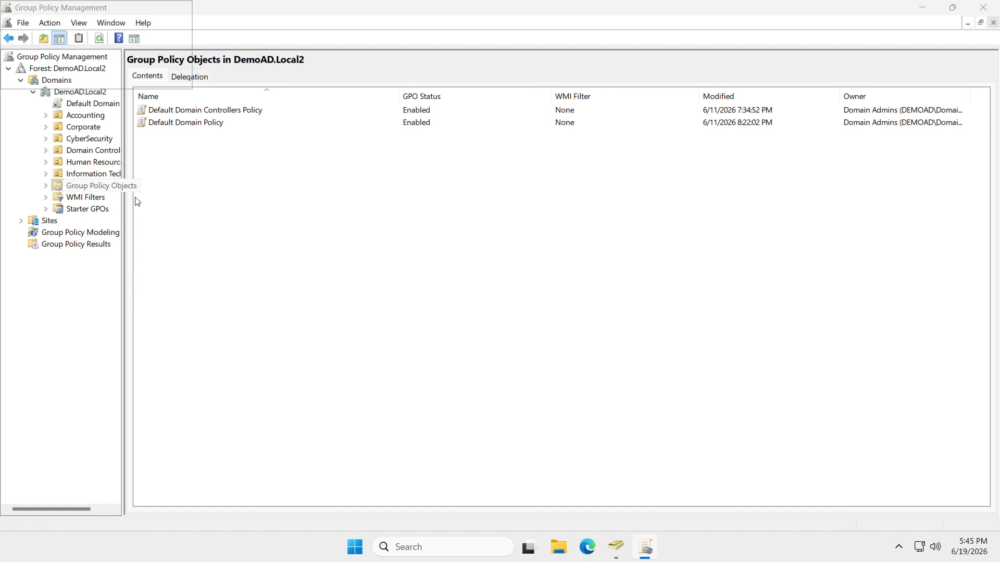

### 2. Create a new GPO

Right-click the **Group Policy Objects** container and choose **New** to create a purpose-named GPO — naming it clearly (`GPO_Corporate_Security_Hardening`) makes it obvious what the policy does and which scope it's intended for.

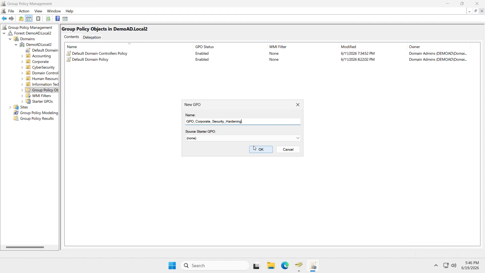

### 3. Open the Group Policy Management Editor

Editing a GPO opens the **Group Policy Management Editor**, split into **Computer Configuration** and **User Configuration**. Security-related settings that apply regardless of who logs on — like inactivity limits and logon banners — live under **Computer Configuration → Windows Settings → Security Settings**.

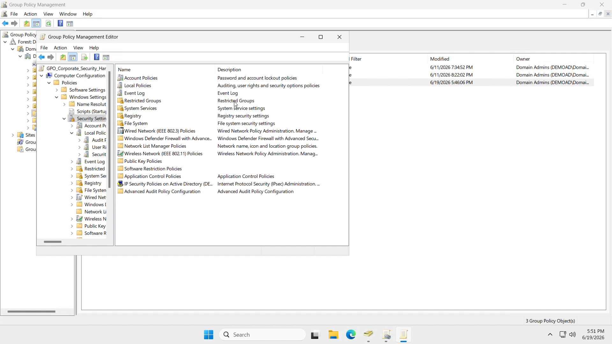

Within **Local Policies**, the relevant subcategories are **Audit Policy**, **User Rights Assignment**, and **Security Options** — the last of which holds both the inactivity limit and the logon banner settings.

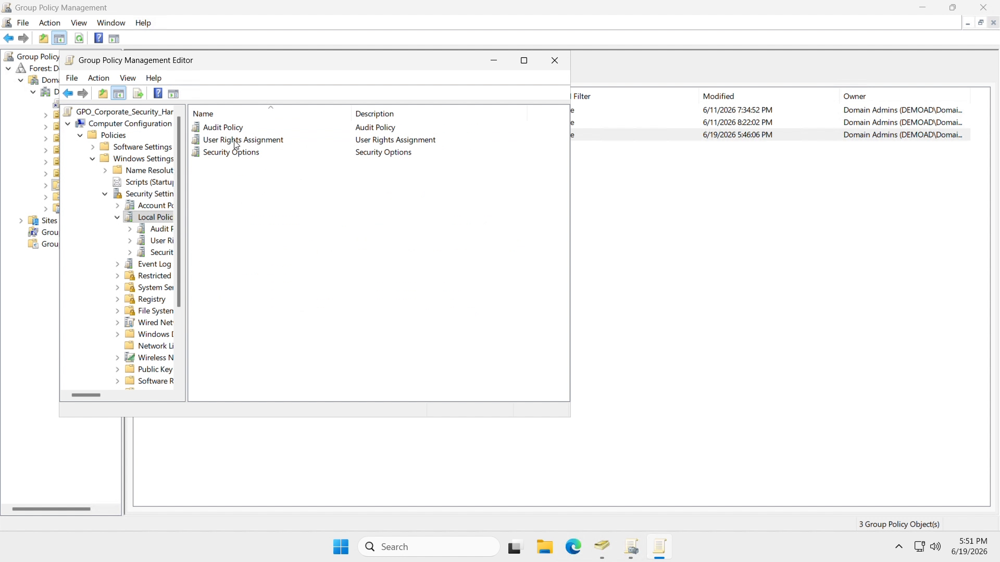

**Security Options** contains dozens of individual settings, from domain controller and domain member behavior to interactive logon controls:

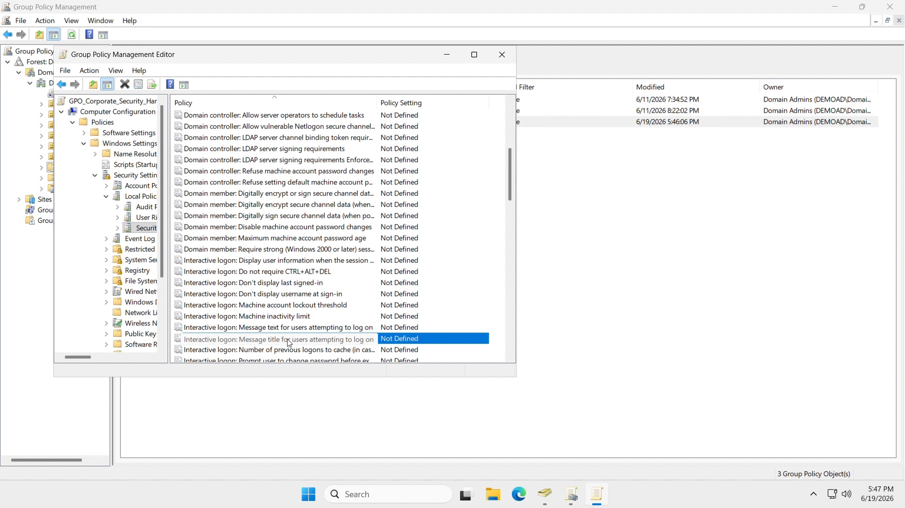

### 4. Set the machine inactivity limit

Locate **Interactive logon: Machine inactivity limit**, enable **Define this policy setting**, and set the number of seconds of idle time before the machine locks. This policy was set to **900 seconds (15 minutes)**.

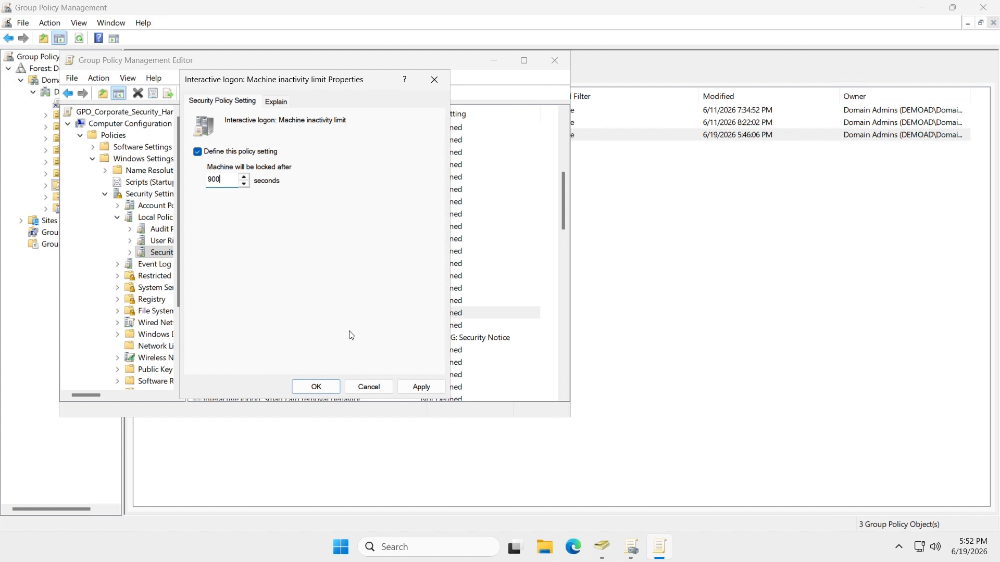

### 5. Configure the logon warning banner

Under the same **Security Options** node, **Interactive logon: Message title for users attempting to log on** sets the banner's title bar text — configured here as `WARNING: Security Notice`.

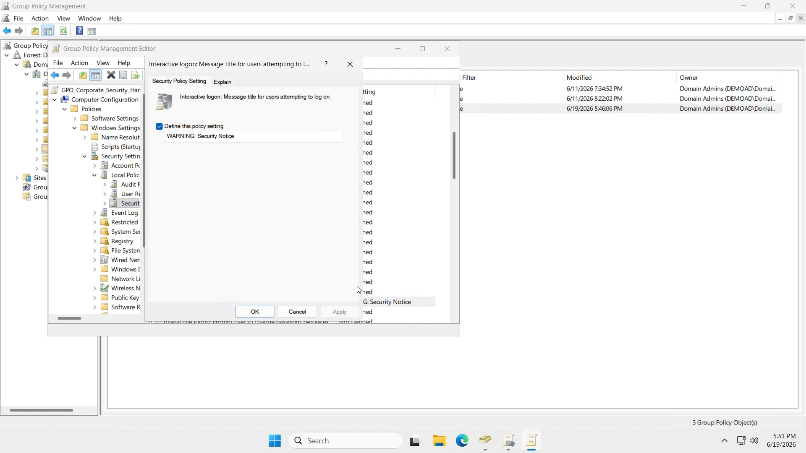

Its companion setting, **Interactive logon: Message text for users attempting to log on**, holds the full warning body users see before authenticating. Once both are defined, they show up next to each other in the Security Options list:

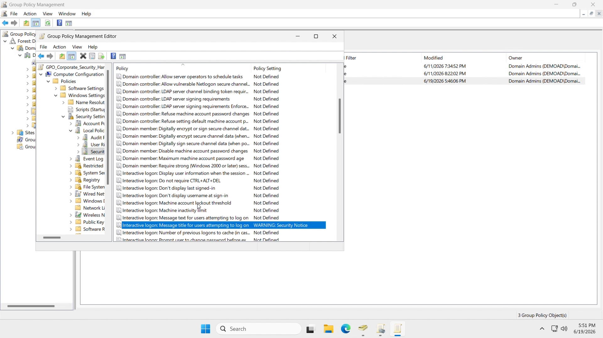

### 6. Restrict Control Panel and PC settings access

For a user-facing restriction, switch to **User Configuration → Windows Settings**, then drill into **Administrative Templates**:

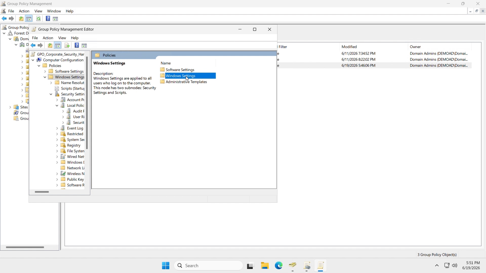

Under **Administrative Templates → Control Panel**, enable **Prohibit access to Control Panel and PC settings** to block standard users from opening Control Panel, PC settings, or related items from the Start screen, File Explorer, or search results.

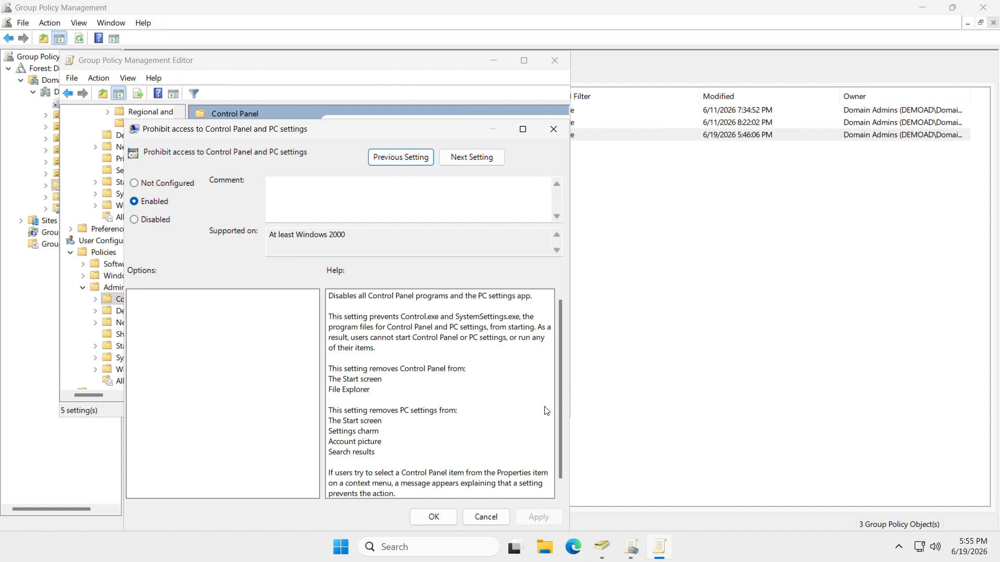

### 7. Apply and push the policy

With the settings defined, close the editor. GPOs linked to an OU apply automatically on the domain's normal refresh cycle, but for immediate testing, force an update from an elevated command prompt on a target machine:

```
gpupdate /force
```

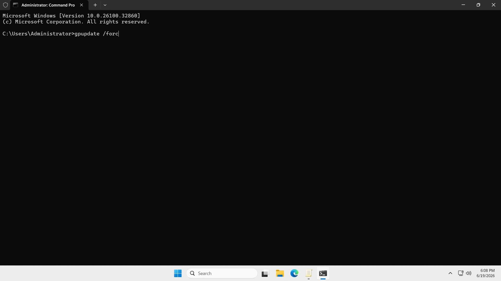

A successful run confirms both the computer and user portions of the policy applied:

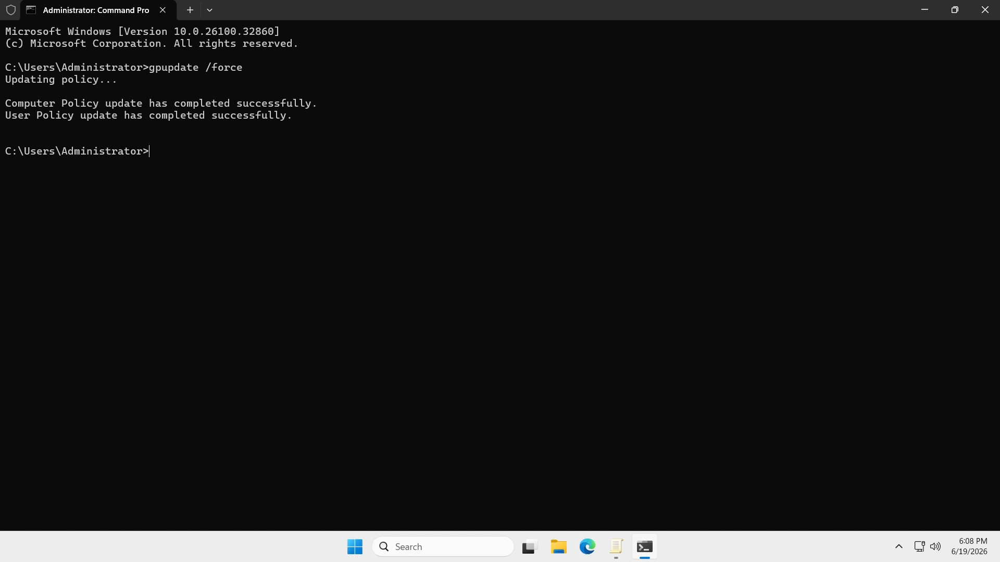

## Notes

- **Link the GPO to the correct OU(s)** before running `gpupdate` — a GPO only affects accounts and computers in OUs it's linked to (or the domain root, for org-wide policies). Use GPMC's **Link an Existing GPO** action on the target OU, or drag the GPO from the Group Policy Objects container onto the OU.
- **Security Options settings** (inactivity limit, logon banner) live under *Computer Configuration*, so they apply to the machine regardless of which user logs on — useful for shared or kiosk-style machines.
- **Administrative Template restrictions** (Control Panel access) live under *User Configuration*, so they follow the user account and can be scoped to specific groups or OUs (e.g. standard employees) while leaving IT/admin OUs unaffected.
- Use **Group Policy Modeling** or **Group Policy Results** (visible in the GPMC left-hand tree) to simulate or verify exactly which policies apply to a given user or computer before rolling out broadly.
